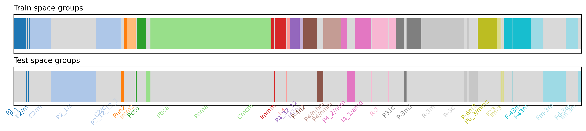
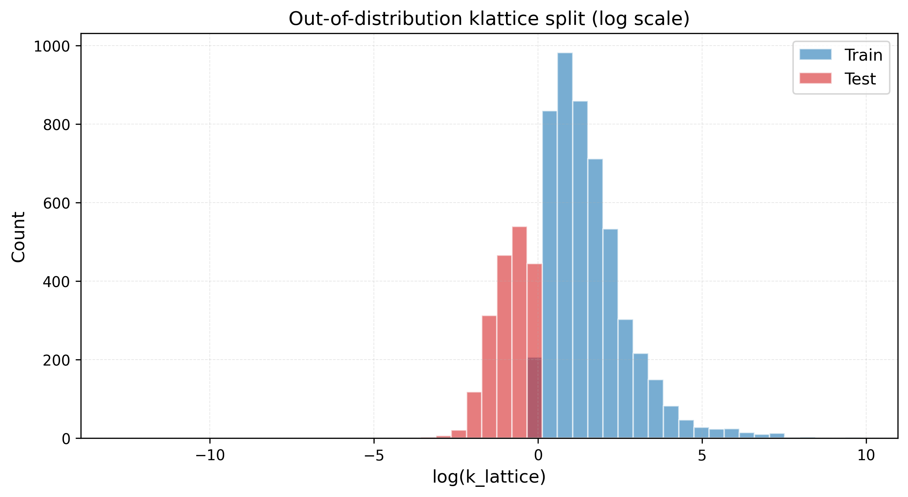

## MACE workflow 

This branch adds two ways to predict lattice thermal conductivity with MACE-related models: **end-to-end fine-tuning** on the provided ASE xyz splits, and **frozen MACE-OMat descriptors** followed by ordinary least-squares regression (see `Mace_feat_pred.ipynb`).

### Get the branch and large descriptor files

Descriptor pickles under `mace_omat/` are stored with [Git LFS](https://git-lfs.github.com). After cloning the repository:

```bash
git lfs install
git checkout mahpe
git lfs pull
```

### Environment

Install the dataset dependencies:

```bash
pip install -r requirements.txt
```

For MACE fine-tuning and descriptor extraction, install [MACE](https://github.com/ACEsuit/mace) and a PyTorch build that matches your CUDA setup (see the MACE repository for current install instructions). A GPU is strongly recommended for fine-tuning and for running `mace_features.py`.

Training hyperparameters live in `Mace.toml`. By default, Weights & Biases logging is enabled (`wandb = true`); set `wandb = false` in that file if you do not use W&B.

### MACE-specific files

| Path | Role |
|------|------|
| `datasplit/train_{split}.xyz`, `datasplit/test_{split}.xyz` | ASE structures and `log_klat` labels for each split (`random_split`, `space_group_split`, `ood_split`) |
| `Mace.toml` | Fine-tuning configuration (learning rate, architecture, `energy_key = "log_klat"`, etc.) |
| `Mace_run_train.py` | Wrapper around upstream MACE training; reads `Mace.toml` and wires train/validation xyz paths |
| `mace_omat/*_mace_descriptors_{train,test}.pkl` | Precomputed MACE-OMat atom descriptors (Git LFS) |
| `mace_features.py` | Example script to recompute descriptors with the MACE-MP foundation model (`medium-mpa-0`) into `mace_mpa/` |
| `Mace_feat_pred.ipynb` | Loads descriptors, mean-pools over atoms, fits `LinearRegression`, reports MAE / R² and κ-WLMAE |

### Fine-tune MACE on a split

`Mace_run_train.py` expects `--file_name` to match the split name used in the xyz filenames under `datasplit/`. Validation uses the corresponding `test_{split}.xyz`.

```bash
# Random 80/20 baseline
python Mace_run_train.py --cfg Mace.toml --file_name random_split --root_dir ./datasplit/

# Space-group disjoint split
python Mace_run_train.py --cfg Mace.toml --file_name space_group_split --root_dir ./datasplit/

# Out-of-distribution (low-κ) split
python Mace_run_train.py --cfg Mace.toml --file_name ood_split --root_dir ./datasplit/
```

Checkpoints and logs are written under the directories named in `Mace.toml` (`chkpt/`, `logs/`, etc.). When training finishes, MACE saves a compiled model named `{split}_compiled.model` in the working directory (for example `random_split_compiled.model`).

### Descriptor baseline (MACE-OMat + linear regression)

1. Ensure `git lfs pull` has populated `mace_omat/`.
2. Open `Mace_feat_pred.ipynb`.
3. Set the `split` variable to one of `random_split`, `space_group_split`, or `ood_split`.
4. Run all cells: descriptors are mean-pooled per structure, a linear model is fit on the training set, and metrics are computed on the test set.

To regenerate descriptors with the **MACE-MP** potential instead of using the bundled OMat files, edit the `split` variable at the top of `mace_features.py` and run:

```bash
python mace_features.py
```

Outputs are written to `mace_mpa/` (created automatically). That step is compute-heavy because descriptors are evaluated structure-by-structure.

## Output Files

### Split Data
- `processed_splits/random_split.pkl`: Random 80/20 baseline split
- `processed_splits/space_group_split.pkl`: Space group disjoint split
- `processed_splits/ood_split.pkl`: Out-of-distribution split

### Visualizations

#### Space Group Split Visualization


Two horizontal rectangles showing:
- **Top**: Train space groups highlighted in color (grayed out = test only)
- **Bottom**: Test space groups highlighted in color (grayed out = train only)
- **X-axis**: Selected space group labels (showing ~20 labels to avoid overlap)
- Each colored segment represents a different space group, with width proportional to sample count
- Largest groups and evenly spaced groups are labeled for clarity

#### OOD klattice Histogram


Overlaid histogram showing:
- **X-axis**: log(k_lattice) with 50 bins for better resolution
- **Blue**: Training set distribution (klat > 0.8)
- **Red**: Test set distribution (klat < 1.0)
- **Grid**: Added for easier reading
- Clearly shows test set concentrated at lower log(klat) values (< 0.4) and train set at higher values (> 0)

## Models

Custom models developed in this work are available in the corresponding branches of this repository.

- [ALIEGNN](https://github.com/dannyzekunren/Dataset_thermoconductivity_pred/tree/Zeyu)
- [Orb+{CNN, TabPFN}](https://github.com/dannyzekunren/Dataset_thermoconductivity_pred/tree/Danny)
- [KAN, MLP, XGB, LR](https://github.com/dannyzekunren/Dataset_thermoconductivity_pred/tree/jianghai)
- [ViKING](https://github.com/dannyzekunren/Dataset_thermoconductivity_pred/tree/kedhip)
- [MACE fine-tuning and descriptor-based prediction](https://github.com/dannyzekunren/Dataset_thermoconductivity_pred/tree/mahpe)

For the benchmark models used in the paper, please refer to their official repositories and follow the instructions provided there to reproduce the reported results:

- [HackNIP](https://github.com/parkyjmit/HackNIP)
- [CGCNN](https://github.com/txie-93/cgcnn)
- [WyFormer](https://github.com/SymmetryAdvantage/WyckoffTransformer)
- [CrabNet](https://github.com/anthony-wang/CrabNet)
- [eqV2-MEX](https://github.com/panmianzhi/Matching-based-EXtrapolation)

## Assessment Metrics

### Traditional Metrics
- **R² (Coefficient of Determination)**: Standard regression performance
- **MAE (Mean Absolute Error)**: Average absolute prediction error

### Specialized Metrics

#### Low-κ Weighted Log-MAE (κ-WLMAE)
A specialized metric designed for thermal conductivity prediction that emphasizes accuracy in the low thermal conductivity regime:

**Formula:**
```
κ-WLMAE = Σᵢ w(yᵢ) |log(ŷᵢ) - log(yᵢ)| / Σᵢ w(yᵢ)
```

**Weight Function:**
```
w(y) = min(1, (2/y)^p)
```

**Parameters:**
- **p = 2** (default): Mild-moderate emphasis on low-κ materials
- **p > 2**: Stronger focus on materials with κ < 2
- **log_base**: Natural log ('e') or base-10 ('10')

**Implementation:**
```python
import numpy as np

def kappa_wlmae(y_true, y_pred, p=2, log_base='e', eps=1e-12):
    y_true = np.asarray(y_true, dtype=float)
    y_pred = np.asarray(y_pred, dtype=float)
    # weights: full weight <=2; decay as (2/y)^p above 2
    w = np.minimum(1.0, (2.0 / np.maximum(y_true, eps))**p)
    # log error (natural or base-10)
    if log_base == 'e':
        err = np.abs(np.log(np.maximum(y_pred, eps)) - np.log(np.maximum(y_true, eps)))
    elif log_base == '10':
        err = np.abs(np.log10(np.maximum(y_pred, eps)) - np.log10(np.maximum(y_true, eps)))
    else:
        raise ValueError("log_base must be 'e' or '10'")
    return np.sum(w * err) / np.sum(w)
```

**Why κ-WLMAE:**
- **Unit-agnostic**: Multiplicative error measurement (|log ŷ - log y| ≈ relative error)
- **Low-κ focused**: Samples with κ ≤ 2 get full weight; above 2, weight decays smoothly
- **Robust**: Handles the wide range of thermal conductivity values 
- **Simple**: One hyperparameter (p) controls emphasis on low-κ materials
- **No discontinuities**: Smooth weight function, easy to implement and explain

## Key Features

- ✅ Three split strategies: random baseline, space group disjoint, OOD
- ✅ Comprehensive features: structures, Wyckoff positions, space groups
- ✅ Log-transformed targets with original values included
- ✅ Zero sample overlap across all splits
- ✅ Optional Materials Project API integration
- ✅ Pymatgen Structure objects for analysis
- ✅ Reproducible with fixed random seeds
- ✅ Specialized assessment metrics for thermal conductivity prediction

## Notes

- Original dataset had 200 duplicate mp_ids (handled appropriately)
- All splits ensure no sample overlap
- OOD split excludes 10 samples spanning thresholds
- Additional properties require MP API key

## Citation

If you use this dataset or the surrogate models in your work, please consider citing the following papers:

```bibtex
@article{Ohnishi2026,
  title = {Database and deep-learning scalability of anharmonic phonon properties by automated brute-force first-principles calculations},
  volume = {12},
  ISSN = {2057-3960},
  url = {http://dx.doi.org/10.1038/s41524-026-02033-w},
  DOI = {10.1038/s41524-026-02033-w},
  number = {1},
  journal = {npj Computational Materials},
  publisher = {Springer Science and Business Media LLC},
  author = {Ohnishi, Masato and Deng, Tianqi and Torres, Pol and Xu, Zhihao and Tadano, Terumasa and Zhang, Haoming and Nong, Wei and Hanai, Masatoshi and Wang, Zeyu and Morita, Michimasa and Tian, Zhiting and Hu, Ming and Ruan, Xiulin and Yoshida, Ryo and Suzumura, Toyotaro and Lindsay, Lucas and McGaughey, Alan J. H. and Luo, Tengfei and Hippalgaonkar, Kedar and Shiomi, Junichiro},
  year = {2026},
  month = apr
}

@misc{Wang2026,
  doi = {10.48550/ARXIV.2605.11610},
  url = {https://arxiv.org/abs/2605.11610},
  author = {Wang, Zeyu and Yamazaki, Shuya and Petersen, Martin Hoffmann and Ohnishi, Masato and Yamamoto, Tomiya and Nong, Wei and Wang, Jianghai and Zhu, Ruiming and Hanai, Masatoshi and Morita, Michimasa and Suzumura, Toyotaro and Ren, Zekun and Shiomi, Junichiro and Hippalgaonkar, Kedar},
  keywords = {Materials Science (cond-mat.mtrl-sci), Computational Physics (physics.comp-ph), FOS: Physical sciences, FOS: Physical sciences},
  title = {Fast and Accurate Prediction of Lattice Thermal Conductivity via Machine Learning Surrogates},
  publisher = {arXiv},
  year = {2026},
  copyright = {Creative Commons Attribution 4.0 International}
}

